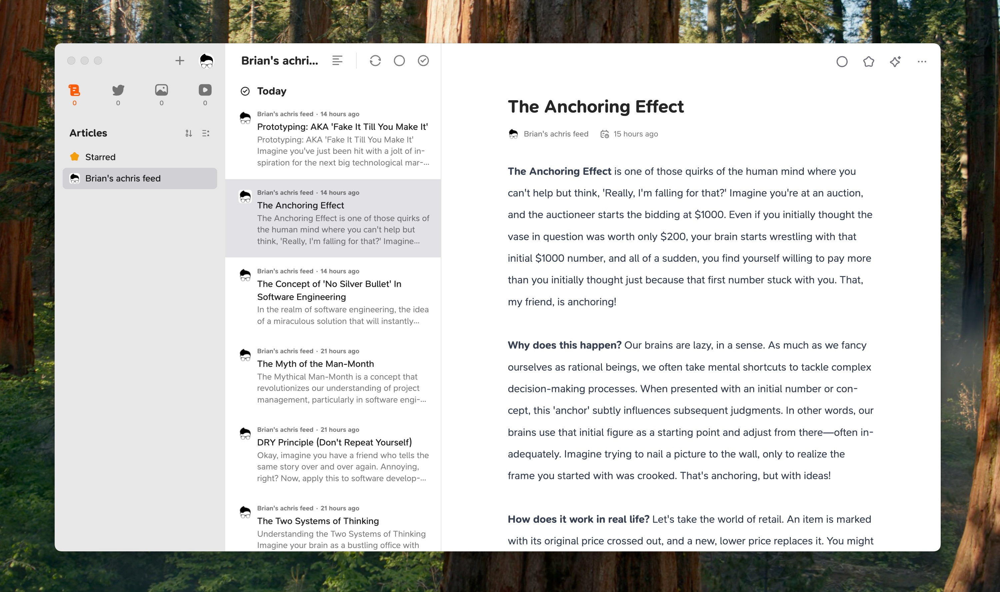

# 🧠 Brian RSS

> Brian is an anagram of 🧠 brain.

Daily RSS feed for continuous learners. Brian RSS creates personalized learning content about your favorite books, delivered daily through RSS and audio formats.

Want to see it in action? Check out my personal feed at [brian.achris.me/rss](https://brian.achris.me/rss) 📚

Public Docker images available at [Docker Hub](https://hub.docker.com/r/achris15/brian-rss).



## ✨ What does Brian RSS do?

- Keeps a list of books you want to learn more about
- Extract a new random topic from each book
- Generate a summary of that topic using AI
- Create audio summaries in a podcast-like format
- Deliver these content daily through RSS feeds

Brian RSS leverages OpenAI's model knowledge about books, so you don't need to upload any book content or PDF to generate summaries.

## 🛠️ Tech Stack

- Ruby & Sinatra
- Docker
- OpenAI API
- Cron scheduling

The models used are:

- **gpt-4o** for text generation
- **tts-1** for text-to-speech audio generation

No database is required, as all data is stored in a simple JSON file.

## 💲 Cost

Brian RSS is free to use, but you will need an OpenAI API key for the AI features. The cost will depend on your usage of the OpenAI API.
From my personal experience, while using the cheapest **tts-1** text-to-speech model, **the cost is approximately $0.05 per post generated, including text + audio.**

## 🏗️ Quick Start

## 📋 Prerequisites

- Docker and Docker Compose installed
- OpenAI API key (get one at https://platform.openai.com)
- Basic understanding of RSS feeds
- A domain name (optional, for public hosting)

### 👉 Docker Compose Run (Recommended)

You can use Docker Compose to quickly set up and run Brian RSS.

1. Start from the `docker-compose.yml` file present in the repository and personalize it with your environment variables.

```yml
environment:
  RACK_ENV: production
  ENVIRONMENT: production
  PORT: 4567
  FEED_TITLE: "Brian: achris RSS Feed"
  FEED_LINK: https://achris.me
  FEED_DOMAIN: brian.achris.me
  FEED_DESCRIPTION: AI-Generated RSS Feeds from books I would like to learn more about
  MODEL: gpt-4o
  OPENAI_ACCESS_TOKEN: your-openai-access-token
```

2. Configure your reading list in `history.json` by provinding the book title and its author, topics covered, and last updated date.

Example:

```json
[
  {
    "book": "Thinking, Fast and Slow by Daniel Kahneman",
    "covered_topics": ["Cognitive Biases and Heuristics"],
    "updated_at": "2024-01-01T10:00:00Z"
  }
]
```

3. Then, start your Brian RSS instance with:

```bash
docker compose up -d
```

4. Access your feed:
   - RSS feed available at: `http://your-domain.com/rss`
   - Audio files at: `http://your-domain.com/audio/<filename>`
   - Daily updates at 6:00 AM UTC

## 🤝 Contributing

We welcome contributions! Here's how:

1. Fork the repository
2. Create your feature branch (`git checkout -b feature/amazing-feature`)
3. Commit your changes (`git commit -m 'Add amazing feature'`)
4. Push to the branch (`git push origin feature/amazing-feature`)
5. Open a Pull Request

## 📝 License

GNU GPLv3 Licensed - Feel free to use and modify!
